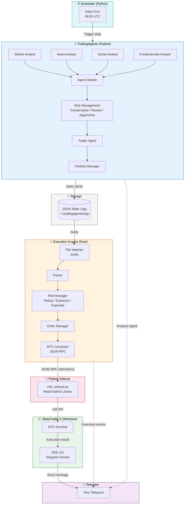
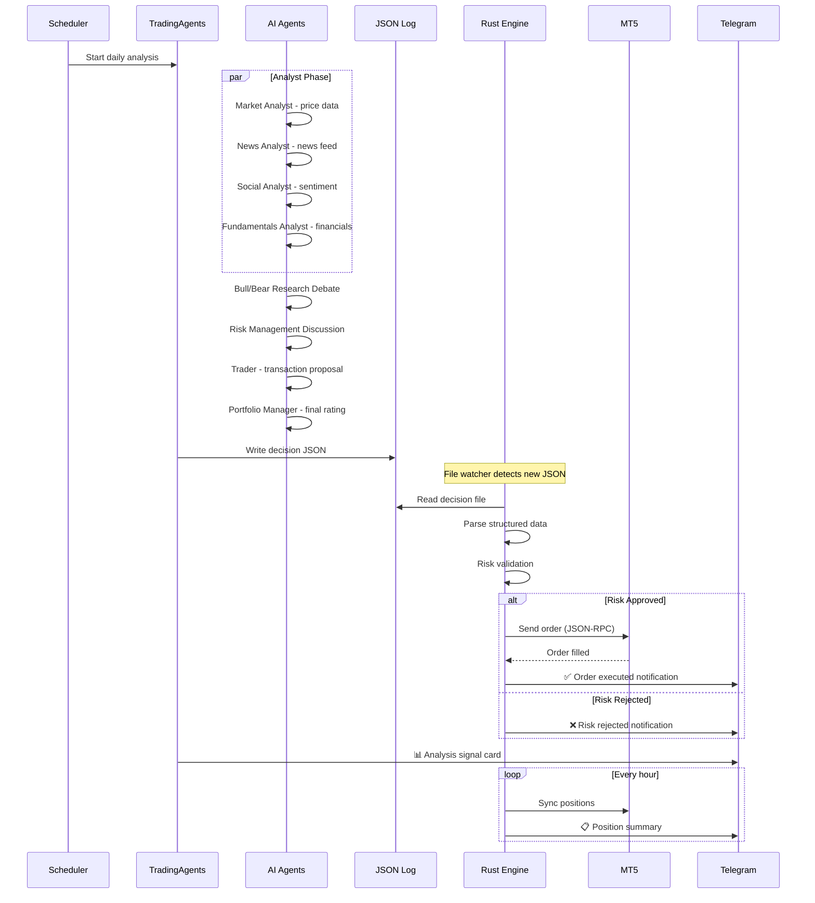
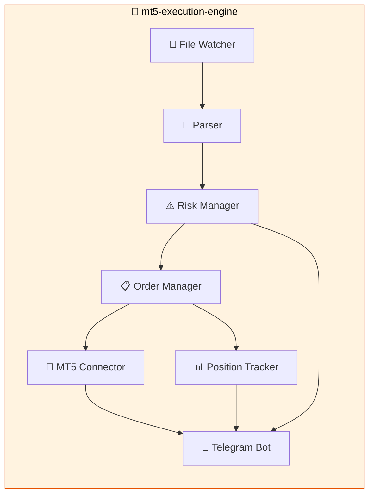

# Architecture

## System Design

## Agent Interaction Flow

## Component Details

### Python Layer (TradingAgents)

The Python framework uses **LangGraph** to orchestrate a directed acyclic graph of agent nodes. Each agent is an LLM-powered node with access to specific tools (data vendors, analysis functions).

**Agents:**

| Agent | Role | Tools |
|-------|------|-------|
| Market Analyst | Technical indicators, price action | yfinance, stockstats |
| News Analyst | Latest news sentiment | yfinance news |
| Social Analyst | Social sentiment analysis | yfinance |
| Fundamentals Analyst | Financial statements | yfinance |
| Bull Researcher | Makes investment case | Analyst reports |
| Bear Researcher | Makes against case | Analyst reports |
| Risk Managers | Conservative/Neutral/Aggressive | Portfolio data |
| Trader | Transaction proposal | Research plan |
| Portfolio Manager | Final rating & execution plan | All reports |

**Output:** JSON state files written to `~/.tradingagents/logs/<TICKER>/TradingAgentsStrategy_logs/full_states_log_<DATE>.json`

### Rust Layer (mt5-execution-engine)

The Rust engine is a high-performance, real-time execution bridge:

**Event Flow:**

| Step | Component | Action | Telegram? |
|------|-----------|--------|-----------|
| 1 | Watcher | Detects new JSON file | — |
| 2 | Parser | Extracts rating, prices, sizing | — |
| 3 | Risk Manager | Validates decision | ✅ Yes |
| 4 | Order Manager | Creates order record | — |
| 5 | Connector | Sends to MT5 via JSON-RPC | — |
| 6 | Connector | Returns fill result | ✅ Yes |
| 7 | Position Tracker | Updates positions | ✅ Hourly |

## Data Flow

1. **Scheduler** triggers daily analysis at configured time (default: 08:00 UTC)
2. **TradingAgents** runs the pipeline for each ticker in the watchlist
3. **JSON state** is written to shared volume
4. **Rust engine** detects new file via `inotify`
5. **Risk validation** checks rating threshold, exposure limits, duplicate prevention
6. **Order execution** via JSON-RPC to MT5 Python sidecar
7. **Telegram notifications** at every stage from both Python and Rust layers
