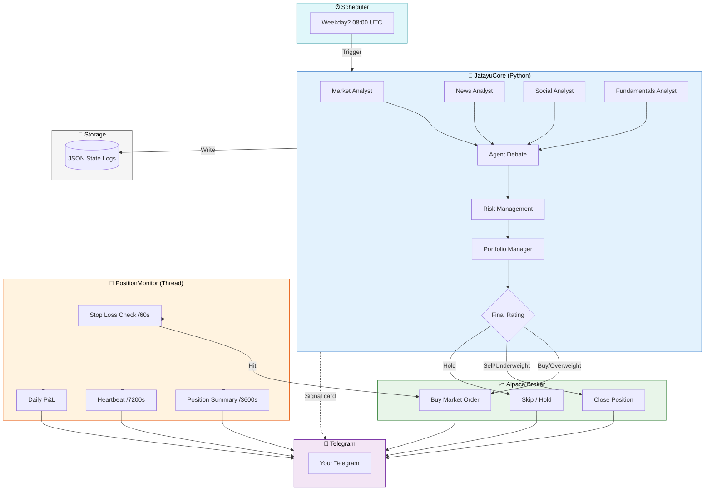
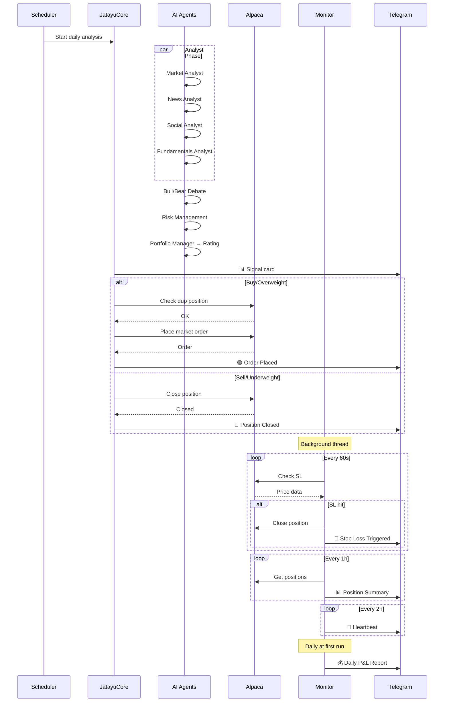

# Architecture

## System Design

## Agent Flow

## Components

### JatayuCore (Python)
| Agent | Role |
|-------|------|
| Market Analyst | Technical indicators, price action |
| News Analyst | Latest news sentiment |
| Social Analyst | Social sentiment analysis |
| Fundamentals Analyst | Financial statements |
| Bull/Bear Researchers | Structured debate |
| Risk Managers | Conservative/Neutral/Aggressive |
| Portfolio Manager | Final rating & execution plan |

### Alpaca Broker (`tradingagents/brokers/alpaca_broker.py`)
| Feature | Detail |
|---------|--------|
| Paper/Live | Configurable via constructor |
| Buy Execution | Market order, qty from % equity |
| Sell Execution | Close existing position |
| Duplicate Guard | Skip Buy if position exists |
| Sizing | % equity → shares, fallback 1% |
| Telegram Notif | Order placed/failed sent via notifier |

### PositionMonitor (`tradingagents/monitor.py`)
| Check | Interval | Action |
|-------|----------|--------|
| Stop Loss | 60s | Auto close + Telegram alert |
| Position Summary | 1h | P&L per position |
| Heartbeat | 2h | "Still alive" + equity |
| Daily P&L | Once/day | Equity, cash, buying power |

## Data Flow

1. **Scheduler** checks market hours → triggers analysis
2. **JatayuCore** runs agent pipeline for each ticker
3. **Signal** extracted (Buy/Overweight/Hold/Sell/Underweight)
4. **Alpaca** executes if signal is actionable
5. **Telegram** notified at every stage
6. **PositionMonitor** runs in background daemon thread
