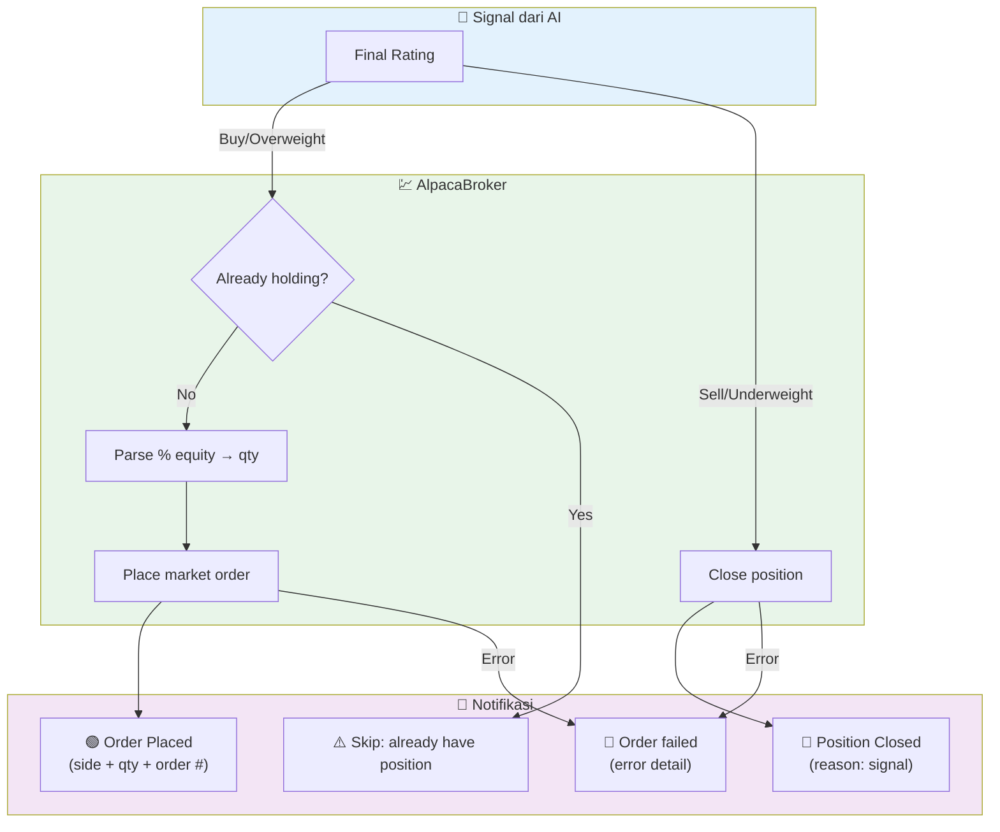

# Broker

JatayuCore mendukung eksekusi order otomatis melalui **Alpaca** — broker US stocks gratis, zero commission, tersedia paper trading untuk testing.

## Flow Eksekusi



## Rating → Action

| Rating | Action | Detail |
|--------|--------|--------|
| 🟢 **Buy** | Market order BUY | Masuk posisi, pakai sizing dari AI |
| 🔵 **Overweight** | Market order BUY | Sama kaya Buy |
| 🟡 **Hold** | Skip | Gak ada eksekusi |
| 🟠 **Underweight** | Close position | Tutup posisi kalo ada |
| 🔴 **Sell** | Close position | Tutup posisi kalo ada |

## Konfigurasi

```bash
# .env
ALPACA_API_KEY=paper_key_id
ALPACA_SECRET_KEY=paper_secret_key
```

### Paper vs Live

AlpacaBroker secara default pake **paper** (testing). Buat pindah ke live:

```python
broker = AlpacaBroker(paper=False)  # real money!
```

## Fitur

### Duplicate Position Guard
Kalo udah punya posisi `AAPL` terus dapet signal Buy lagi, broker skip + kirim Telegram "Already have position".

### Portfolio-Aware Sizing
AI bisa ngasih "Position Sizing: 5%". Broker otomatis convert ke jumlah saham berdasarkan equity akun. Kalo gak bisa parse, fallback ke 1% equity.

### Sell / Close Position
Signal Sell atau Underweight → broker nutup posisi yang ada. Gak open posisi baru.

## Telegram Notifications

Setiap aksi broker dikirim ke Telegram:

| Event | Icon | Contoh |
|-------|------|--------|
| Order Placed | 🟢 | `Alpaca Order Placed — BUY 10 × AAPL — #123` |
| Position Closed | 🔴 | `Alpaca Position Closed — AAPL — signal Sell` |
| Skip | ⚠️ | `Alpaca Skip — AAPL — Already have position` |
| Error | 🚨 | `Alpaca Error — AAPL — Order failed: ...` |
