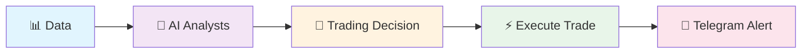
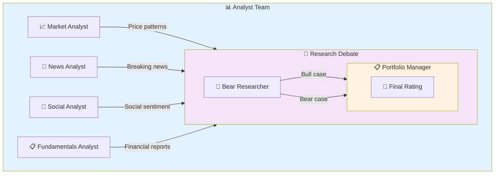

# For Non-Technical Users

Welcome! This page explains what JatayuCore does in plain language — no coding knowledge needed.

## What Is This?

JatayuCore is an **automated trading system** that uses Artificial Intelligence (AI) to analyze stocks and make trading decisions. Think of it as having a team of robot analysts working 24/7 to find trading opportunities.

## How It Works (Simple Version)



**Step by step:**

1. **Data Collection** — The system collects stock data (prices, news, social media sentiment, financial reports)
2. **AI Analysis** — Multiple AI agents analyze the data from different angles
3. **Team Debate** — The agents debate: is this a good time to buy, sell, or hold?
4. **Decision** — A final decision is made with a clear rating
5. **Execution** — The trade is automatically placed in your trading account
6. **Notification** — You get a Telegram message with all the details

## The AI Team



Each agent specializes in one area:
- **Market Analyst** — Studies price charts and technical patterns
- **News Analyst** — Reads financial news and assesses impact
- **Social Analyst** — Gauges market sentiment from social media
- **Fundamentals Analyst** — Examines company financial health
- **Bull Researcher** — Makes the case FOR investing
- **Bear Researcher** — Makes the case AGAINST investing
- **Portfolio Manager** — Makes the final decision

## The Ratings

Every decision gets one of these ratings:

| Rating | Icon | Meaning | Action |
|--------|------|---------|--------|
| **Buy** | 🟢 | Strong buy signal | Enter full position |
| **Overweight** | 🔵 | Moderately bullish | Accumulate on dips |
| **Hold** | 🟡 | Neutral / No edge | Do nothing |
| **Underweight** | 🟠 | Moderately bearish | Reduce position |
| **Sell** | 🔴 | Strong sell signal | Exit or short |

## Telegram Alerts

When a decision is made, you get a message like this in Telegram:

```
🤖 JatayuCore Signal
━━━━━━━━━━━━━━━━━━
🟢 Rating: Buy
Ticker: NVDA
Entry: $124.50
Stop Loss: $118.27
Target: $150.00
Sizing: 5% of portfolio
```

You'll also get alerts when:
- ✅ A trade is successfully executed
- ❌ A trade fails (with reason)
- 📊 A daily position summary
- 🚨 An error occurs

## What You Can Control

Without writing code, you can configure:

| Setting | What It Does |
|---------|-------------|
| **Tickers to watch** | Which stocks to analyze (e.g., NVDA, AAPL) |
| **Analysis time** | When to run daily analysis (e.g., 8:00 AM) |
| **Risk level** | How much of your account to risk per trade |
| **Stop-loss** | Automatic loss limit per trade |
| **Minimum rating** | Only act on ratings above a threshold |

## I Have an Idea / Suggestion

Great! Here's how to contribute ideas:

1. **Open an Issue** → Go to `https://github.com/komelImoet/JatayuCore/issues` and click "New Issue"
2. **Tell us your idea** — Describe what you'd like to see added or changed
3. **Tag it** — Use the `enhancement` or `feature-request` label

Ideas we're currently considering:
- Support for crypto trading
- Web dashboard with charts
- More technical indicators (RSI, MACD crossovers)
- Backtesting against historical data
- Multi-timeframe analysis

## Quick Start (Non-Technical)

Want to see it in action? The fastest way is through Docker:

```bash
# If you have Docker installed:
docker compose up -d jatayucore
```

Then just check your Telegram for the daily analysis results!

---

*Need help? Open an issue at https://github.com/komelImoet/JatayuCore/issues*
