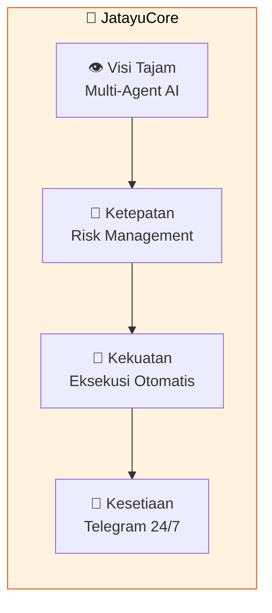
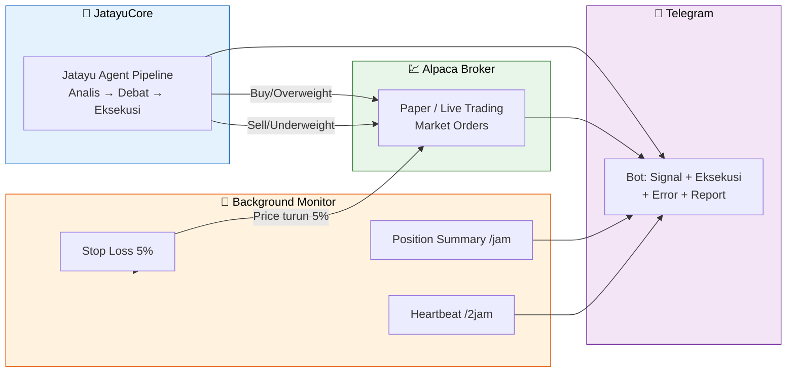

# JatayuCore

<p align="center">
  
</p>

**Multi-Agent AI Trading Framework** — Terinspirasi dari Jatayu, elang mitologis yang memiliki visi tajam, ketepatan, dan kesetiaan.



## Pipeline



## Fitur

- **Auto Execution** — Buy/Sell otomatis ke [Alpaca](https://alpaca.markets) (paper/live)
- **Stop Loss Guard** — Background thread auto close posisi kalo turun 5%
- **Position Summary** — Laporan posisi + P&L tiap jam ke Telegram
- **Daily P&L Report** — Rekap portfolio tiap hari
- **Health Heartbeat** — Bot ngasih tau "saya masih hidup" tiap 2 jam
- **Weekend Skip** — Gak jalan di Sabtu/Minggu
- **Daemon Mode** — `python main.py schedule -D` jalan di background

## Start Cepat

```bash
git clone https://github.com/komelImoet/JatayuCore.git
cd JatayuCore

# Setup Telegram + Alpaca
export TELEGRAM_BOT_TOKEN="token_lo"
export TELEGRAM_CHAT_ID="chat_id_lo"
export ALPACA_API_KEY="paper_key_lo"
export ALPACA_SECRET_KEY="paper_secret_lo"

# Analisis + auto execute
uv run python main.py run AAPL

# Scheduler background (otomatis tiap hari)
uv run python main.py schedule -D --tickers AAPL,NVDA,MSFT
```

---

*"Terbang tinggi, sambar tepat, pantang menyerah."* — JatayuCore
