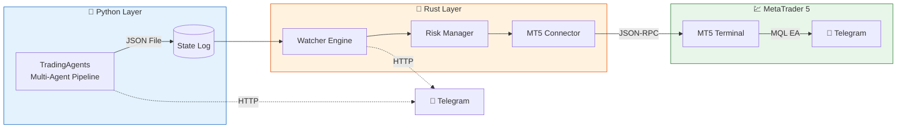
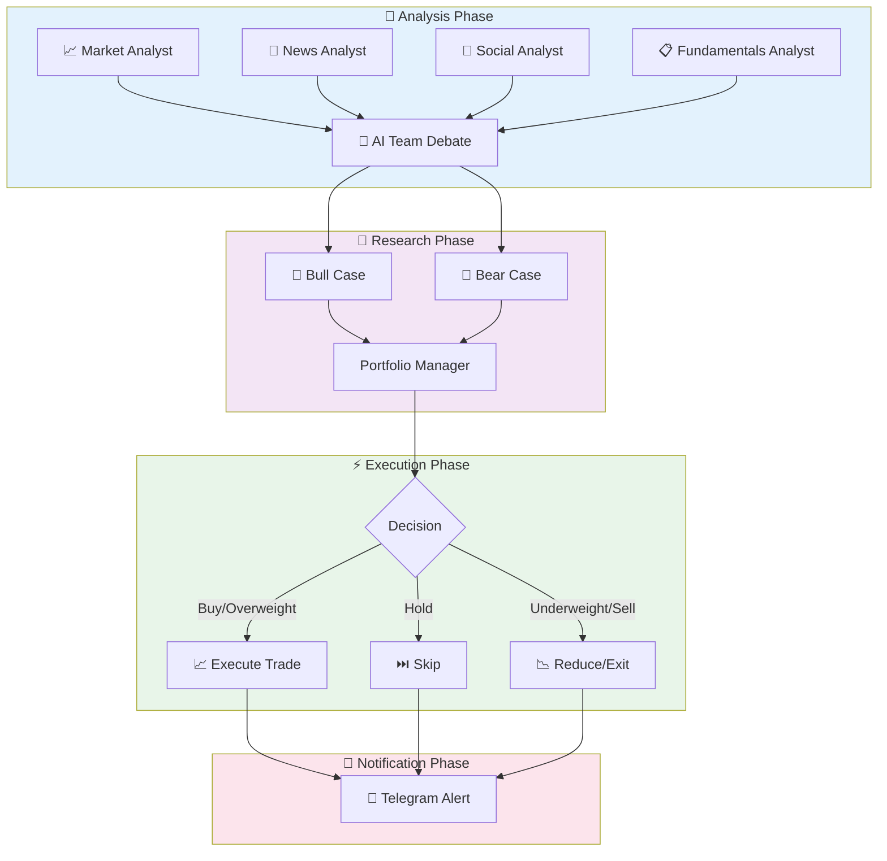

# TradingAgents

**Multi-Agent LLM Financial Trading Framework** with automated MetaTrader 5 execution and real-time Telegram notifications.

## Overview

TradingAgents orchestrates a team of AI-powered analyst agents that research, debate, and produce trading decisions.



## Pipeline Flow



## Features

- **Multi-Agent AI Pipeline** — 7 specialized agents collaborate on each decision
- **MetaTrader 5 Integration** — Automated order execution via Rust bridge
- **Telegram Alerts** — Real-time notifications at every stage
- **Scheduler** — Fully automated daily trading sessions
- **Risk Management** — Configurable position sizing, exposure limits, stop-loss enforcement
- **Docker Support** — Deploy the entire stack with Docker Compose

## Quick Start

```bash
# Clone the repo
git clone https://github.com/komelImoet/TradingAgents.git
cd TradingAgents

# Set up Telegram (optional)
export TELEGRAM_BOT_TOKEN="your_bot_token"
export TELEGRAM_CHAT_ID="your_chat_id"

# Run single analysis
python main.py run NVDA

# Run scheduler (daily at 08:00 UTC)
python main.py schedule --tickers NVDA,AAPL,SPY
```

## Components

| Component | Language | Purpose |
|-----------|----------|---------|
| **TradingAgents** | Python | LLM-powered multi-agent analysis pipeline |
| **mt5-execution-engine** | Rust | Real-time decision watcher, risk manager, MT5 bridge |

---

*Not a developer? Check the [For Non-Technical Users](for-non-technical.md) page.*
