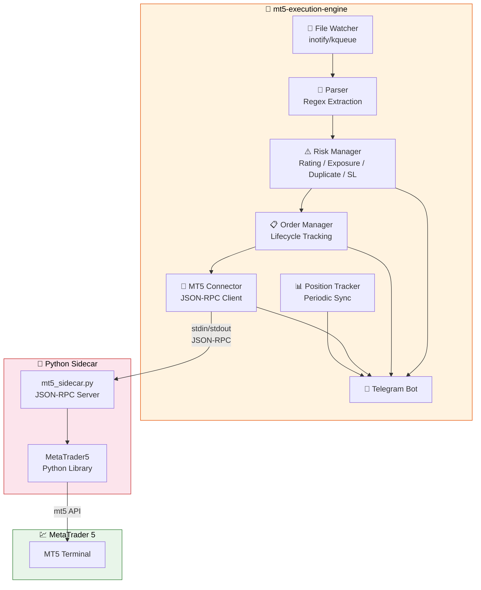
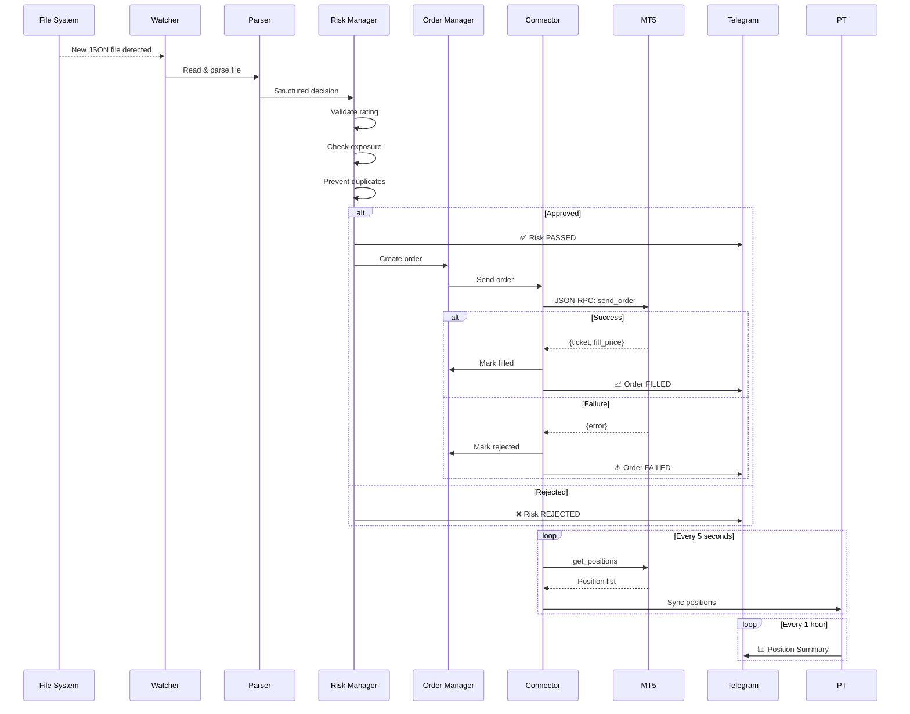
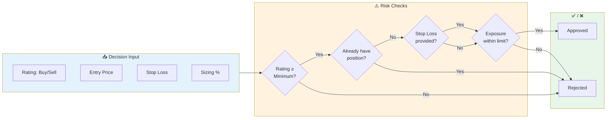
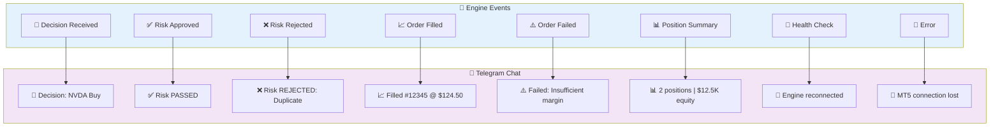
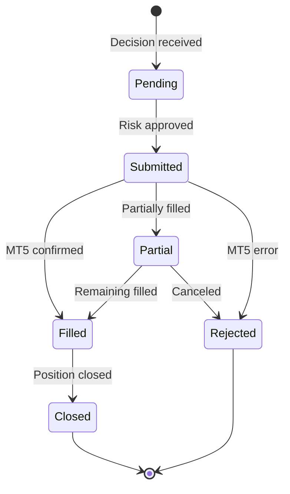

# MT5 Execution Engine

The `mt5-execution-engine` is a high-performance Rust bridge that monitors JatayuCore's JSON output and executes trades in MetaTrader 5.

## Architecture



## How It Works



## CLI Options

```bash
# Run with default config
mt5-execution-engine

# Run with custom config
mt5-execution-engine --config /path/to/config.toml

# Dry-run mode (validate but don't execute)
mt5-execution-engine --dry-run
```

## Risk Rules



### Risk Configuration

| Rule | Config Key | Default | Description |
|------|-----------|---------|-------------|
| Minimum Rating | `risk.min_rating` | Hold | Skip ratings below this |
| Max Position | `risk.max_position_pct` | 10% | Max % of equity per position |
| Max Exposure | `risk.max_total_exposure_pct` | 50% | Max % across all positions |
| Require Stop Loss | `risk.require_stop_loss` | true | Reject if no SL provided |
| Default Stop Loss | `risk.default_stop_loss_pct` | 5% | Fallback SL % from entry |
| Max Slippage | `execution.max_slippage_pct` | 0.5% | Max allowed price deviation |
| Retry Attempts | `execution.retry_attempts` | 3 | Retry failed orders |

## Telegram Notifications

The engine sends these real-time alerts:



## Sidecar

The Python sidecar (`sidecar/mt5_sidecar.py`) handles the actual MT5 interaction:

| Method | Description |
|--------|-------------|
| `connect` | Initialize MT5 terminal connection |
| `send_order` | Place market/limit orders |
| `get_positions` | Fetch open positions |
| `get_account_info` | Fetch equity and balance |
| `close_position` | Close positions by ticket |
| `ping` | Health check |
| `shutdown` | Clean shutdown |

## Order Lifecycle


