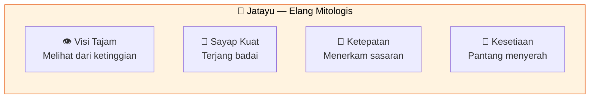
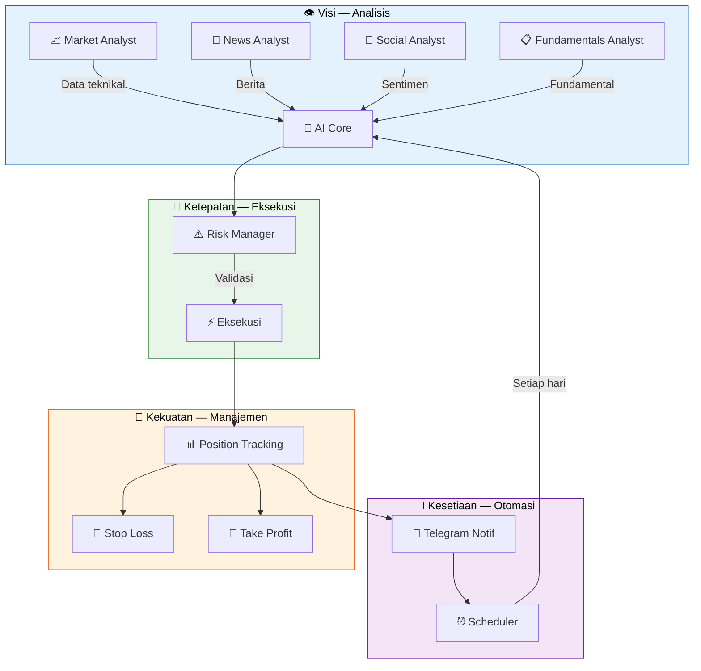

# Filosofi Jatayu

## Kenapa Jatayu?

Dalam kisah **Ramayana**, Jatayu adalah seekor **burung elang raksasa** yang setia, pemberani, dan memiliki visi luas dari ketinggian. Meskipun akhirnya gugur, Jatayu berjuang sampai titik darah penghabisan — sebuah simbol **perjuangan tanpa henti**.

## Makna untuk Sistem Ini

| Nilai Jatayu | Makna dalam Sistem | Implementasi |
|-------------|-------------------|--------------|
| **Visi dari Ketinggian** 🦅 | Melihat pasar dari semua sudut | Multi-agent AI menganalisis harga, berita, sentimen, fundamental |
| **Ketepatan** 🎯 | Tidak asal eksekusi | Risk management sebelum tiap trade |
| **Sayap Kuat** 🪽 | Tahan banting | Diversifikasi posisi, stop-loss, manajemen risiko |
| **Kesetiaan** 💪 | Konsisten tiap hari | Scheduler otomatis, 24/7 monitoring |
| **Berjuang Habis-habisan** 🔥 | Optimasi terus | Feedback loop, refleksi, pembelajaran dari kesalahan |

## Filosofi dalam Kode

Setiap bagian dari sistem mencerminkan nilai Jatayu:

## Prinsip

1. **Jangan serakah** — Jatayu tahu kapan harus menyerang dan kapan menunggu
2. **Disiplin** — Patuhi aturan risiko, walau keyakinan tinggi
3. **Terus belajar** — Setiap trade adalah pelajaran
4. **Transparan** — Semua keputusan dan eksekusi dikirim ke Telegram, gak ada yang disembunyiin
5. **Otomatis** — Manusia mikir strategi, mesin eksekusi dengan setia

---

> *"Lebih baik mati berjuang daripada hidup dalam ketakutan."*  
> — Semangat Jatayu, yang terbang tinggi dan gugur dengan hormat.
