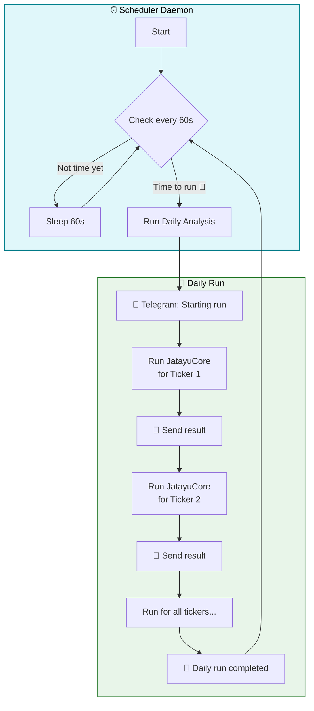
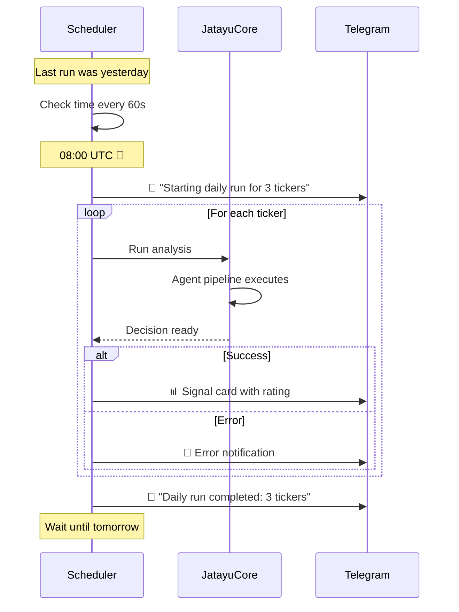

# Scheduler

The `TradingScheduler` runs automated daily trading sessions so you don't have to manually trigger analyses.

## How It Works



## Usage

```bash
# Run scheduler with default settings (08:00 UTC, tickers: NVDA,AAPL,SPY)
python main.py schedule

# Custom tickers and time
python main.py schedule --tickers AAPL,MSFT,GOOGL --hour 9 --minute 30

# With Docker
docker compose up -d jatayucore
```

## Command Options

| Option | Default | Description |
|--------|---------|-------------|
| `--tickers`, `-t` | `NVDA,AAPL,SPY` | Comma-separated stock symbols |
| `--hour` | `8` | Hour to run (UTC, 0-23) |
| `--minute` | `0` | Minute to run (0-59) |

## What Happens Each Run



## Telegram Notifications

The scheduler sends these notifications:

| Event | Icon | Example |
|-------|------|---------|
| **Startup** | 💚 | `Scheduler started` |
| **Daily Start** | 📊 | `Starting daily run for 3 tickers` |
| **Each Result** | 🟢/🔴 | Full analysis signal card |
| **On Error** | 🚨 | Error details with ticker |
| **Completion** | ✅ | `Daily run completed: 3 tickers` |
| **Shutdown** | 💚 | `Scheduler stopped` |

## Non-Technical Summary

Think of the scheduler as your personal trading assistant that:

1. **Wakes up** at a specific time every day (e.g., 8:00 AM)
2. **Checks your watchlist** — all the stocks you want to monitor
3. **Runs the analysis** — the AI team analyzes each stock
4. **Sends you a report** — you get a Telegram message for each result
5. **Goes back to sleep** — waits until the next day

You can configure which stocks to watch and what time to run — no coding required.
