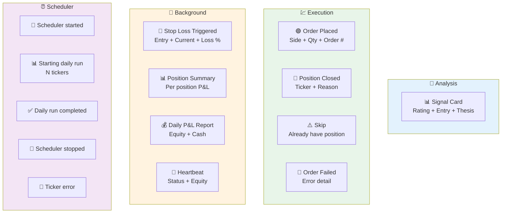

# Telegram Notifications

JatayuCore sends Telegram notifications at every stage — from analysis signals to execution events to background monitoring.

## All Notification Types



## Signal Card

Setelah analysis selesai, lo dapet kartu sinyal kayak gini:

```
🤖 JatayuCore Signal
━━━━━━━━━━━━━━━━━━
🟢 Rating: Buy
Ticker: NVDA
Date: 2026-05-30
Action: Buy
Entry: $124.50
Stop Loss: $118.27
Price Target: $150.00
Sizing: 5% of portfolio
Horizon: 3-6 months

Summary:
Buy NVDA at market with 5% position size.
Set stop-loss at $118.27 (-5%).

Thesis:
NVDA shows strong momentum with...
```

## Execution Events

**Order Placed:**
```
🟢 Alpaca Order Placed
━━━━━━━━━━━━━━━━━━
Side: BUY
Ticker: AAPL
Qty: 10
Order: #12345678
```

**Position Closed:**
```
🔴 Alpaca Position Closed
━━━━━━━━━━━━━━━━━━
Ticker: AAPL
Reason: Sell signal
```

**Skip (duplicate):**
```
⚠️ Alpaca Skip
━━━━━━━━━━━━━━━━━━
Ticker: AAPL
Reason: Already have position
```

**Order Failed:**
```
🚨 JatayuCore Error
━━━━━━━━━━━━━━━━━━
Ticker: AAPL
Error: Order failed: insufficient buying power
```

## Monitor Events

**Stop Loss Triggered:**
```
🚨 Stop Loss Triggered
━━━━━━━━━━━━━━━━━━
Ticker: NVDA
Entry: $124.50
Current: $118.27
Loss: -5.0%
```

**Position Summary (every hour):**
```
📊 Position Summary
━━━━━━━━━━━━━━━━━━
Open Positions: 2
🟢 AAPL: 10× @ $150.20 | P&L +$45.00
🟢 NVDA: 5× @ $124.50 | P&L -$12.30
```

**Daily P&L (once per day):**
```
💰 Daily P&L Report
━━━━━━━━━━━━━━━━━━
Date: 2026-05-30
Equity: $10,500.00
Cash: $5,200.00
Buying Power: $15,700.00
```

**Heartbeat (every 2 hours):**
```
💚 JatayuCore Heartbeat
━━━━━━━━━━━━━━━━━━
Status: Running
Equity: $10,500.00
Cash: $5,200.00
```

## Scheduler Events

| Event | Message |
|-------|---------|
| Start | 💚 Scheduler started |
| Daily Start | 📊 Starting daily run for 3 tickers |
| Ticker Result | Full signal card |
| Ticker Error | 🚨 Error detail |
| Daily Done | ✅ Daily run completed: 3 tickers processed |
| Stop | 💚 Scheduler stopped |

## Configuration

Set in `.env`:

```bash
TELEGRAM_BOT_TOKEN=123456789:ABCdefGHIjklmNOPqrstUVwxyz
TELEGRAM_CHAT_ID=123456789
```

## Disabling Notifications

Leave both vars empty in `.env` to disable all Telegram notifications.
