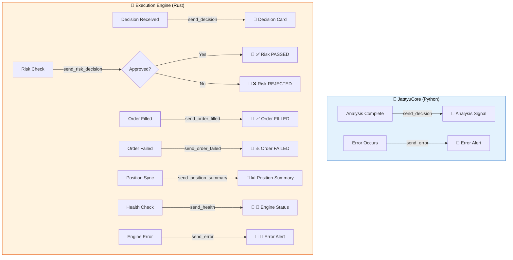
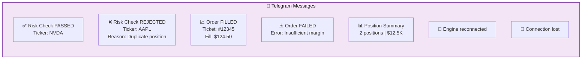

# Telegram Notifications

JatayuCore sends real-time Telegram notifications at every stage of the trading pipeline.

## How Notifications Flow



## Notification Types

### Python Layer — Analysis Signal

When JatayuCore completes an analysis, you receive a detailed signal card:

```
🤖 JatayuCore Signal
━━━━━━━━━━━━━━━━━━
🟢 Rating: Buy
Ticker: NVDA
Date: 2024-05-10
Action: Buy
Entry: 124.50
Stop Loss: 118.27
Price Target: 150.00
Sizing: 5% of portfolio
Horizon: 3-6 months

Summary:
Buy NVDA at market with 5% position size.
Set stop-loss at $118.27 (-5%) and take-profit at $150.00 (+20%).

Thesis:
NVDA shows strong momentum with...
```

### Rust Layer — Execution Events



**Risk Approved:**
```
✅ Risk Check PASSED
━━━━━━━━━━━━━━━━━━
Ticker: NVDA
```

**Risk Rejected:**
```
❌ Risk Check REJECTED
━━━━━━━━━━━━━━━━━━
Ticker: AAPL
Reason: Position already open for AAPL
```

**Order Filled:**
```
📈 Order FILLED
━━━━━━━━━━━━━━━━━━
Ticker: NVDA
Direction: Buy
Ticket: #12345678
Fill Price: 124.48
```

**Order Failed:**
```
⚠️ Order FAILED
━━━━━━━━━━━━━━━━━━
Ticker: NVDA
Error: Insufficient margin
```

### Status & Health

**Position Summary (every hour):**
```
📊 Position Summary
━━━━━━━━━━━━━━━━━━
Open Positions: 2
Equity: 12500.00
Balance: 10000.00
Exposure: 2500.00
```

**Health Alert:**
```
💚 Engine Health
━━━━━━━━━━━━━━━━━━
Status: MT5 reconnected
```

## Configuration

Set in `.env`:

```bash
TELEGRAM_BOT_TOKEN=123456789:ABCdefGHIjklmNOPqrstUVwxyz
TELEGRAM_CHAT_ID=123456789
```

## Bot Token Setup

1. Open Telegram and search for [@BotFather](https://t.me/botfather)
2. Send `/newbot` and follow instructions
3. Copy the token
4. Find your chat ID by messaging [@userinfobot](https://t.me/userinfobot)

## Disabling Notifications

Leave `TELEGRAM_BOT_TOKEN` and `TELEGRAM_CHAT_ID` empty in `.env` to disable all Telegram notifications.
